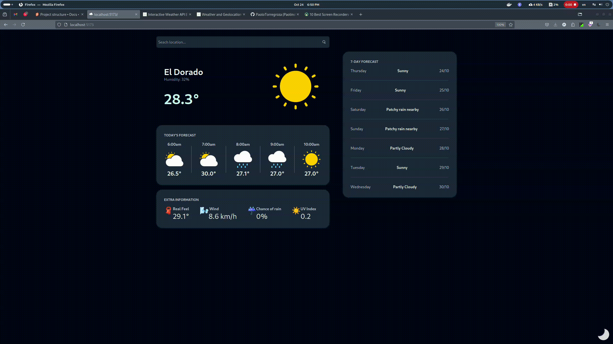
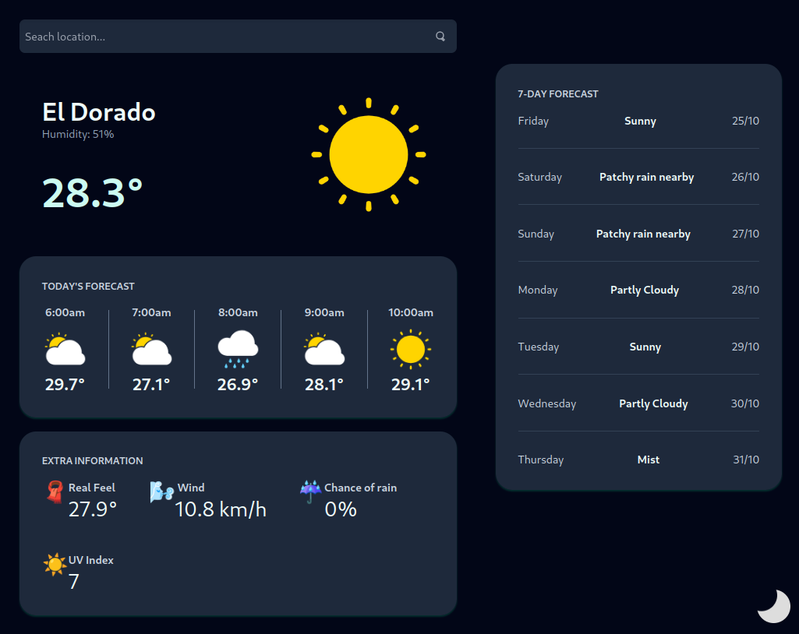
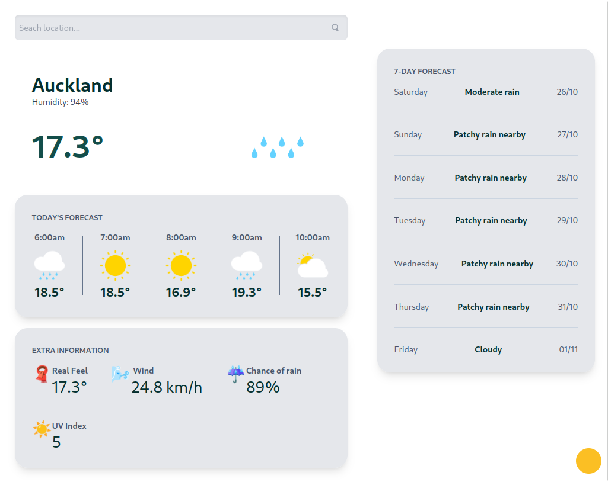
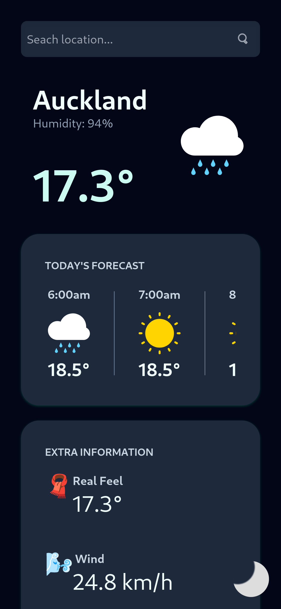
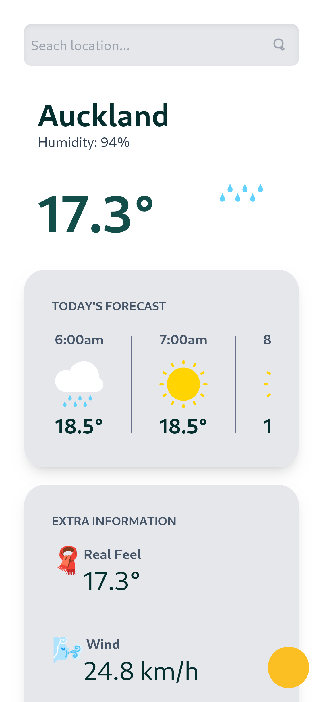

# Svelte 5 testing example

I created this project with two objectives, learn **svelte 5** and improve my **testing** skills on javascript environments using Vitest.

## Overview

The application connects to the OpenWeather API and fetches weather data on the server side, managing all API logic securely on the backend. The client side is focused solely on displaying this information, providing users with current weather conditions, forecasts, and other relevant data in an intuitive and responsive interface.

## 🛠️ Main technologies and tools used

- **SvelteKit**: A framework for building highly optimized web applications, focused on performance and developer experience.
- **Tailwind**: A utility-first CSS framework packed with classes like flex, pt-4, text-center and rotate-90 that can be composed to build any design, directly in your markup.
- **Svelte 5**: The latest version of Svelte, featuring updates to reactivity and event handling.
- **Vitest**: A fast, Vite-powered testing framework designed for modern frontend projects.

## Screenshots and Demo

